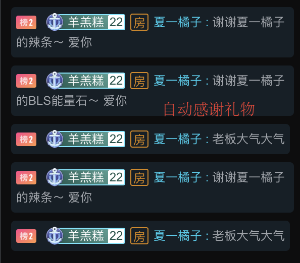

# bilibili直播弹幕姬来啦！

虽然市面上已有很多成熟的直播姬app，但还是想自己手搓一个以获得些许的成就感（说人话就是在家闲的）。

话不多说，来看看我搓的"弹幕姬"有啥好玩的。

## 功能

- 定时弹幕；一般用来给主播打call
- 礼物感谢：自动感谢投喂的礼物哟
- 弹幕聊天；程序调用了聊天机器人api，为贵宾排除寂寞
- 欢迎问候；欢迎进入直播间的舰长/小伙伴
- 检测开播：自动检测开播后运行功能，下播后关闭功能

（目前基础的架子已经搭好了，添加新功能只是人力问题...对，是我懒，哇酷哇酷）

ps：感兴趣的同学可以直接在此基础上二次开发，增加新功能了（就是对响应包的字段值做判断，然后调接口balabala...），具体查看bullet_girl/handle_bullet.go中的handle()函数

## 开始

修改配置文件 -> 启动程序 -> 手机小破站扫码登录 -> 程序运行

1、首先看config.toml，根据注释，修改成适合自己的参数

2、启动程序：

```shell
go run main.go -c="./config.toml"
```

或者，手动build好之后运行

```shell
go build main.go
./main -c="config.toml"
```

3、根据配置文件中的qr_code_path，对应生成二维码，扫码登录

4、程序开始运行，开始体验一下吧！

ps：查看main.go程序，就能知道看到启动的各个goroutine啦，程序结构还是很清晰哒，bullet_girl目录下的文件都是主要功能的实现。

## 展示一下

**没开播，自己和自己玩的截图...**


